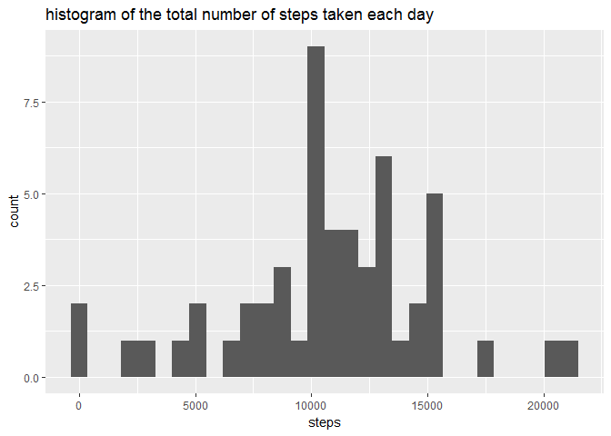
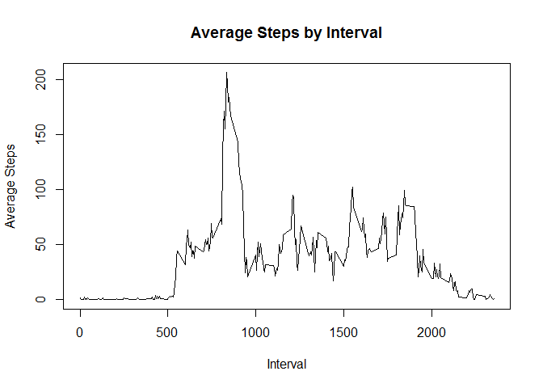
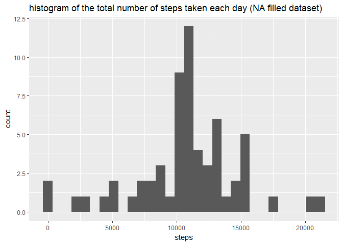

# Reproducible Research: Peer Assessment 1
Eakalak Suthampan  
January 15, 2017  


## Loading and preprocessing the data


```r
# download and unzip data set
#url <- "https://d396qusza40orc.cloudfront.net/repdata%2Fdata%2Factivity.zip"
#download.file(url, destfile = "activity.zip", mode = "wb")
#unzip("activity.zip")

# load data to dataframe
data.raw <- read.csv("activity.csv")

#filter out rows with NA values
data.no_na <- data.raw[complete.cases(data.raw), ]
```


## What is mean total number of steps taken per day?

1. Make a histogram of the total number of steps taken each day


```r
# group total steps by day
data.groupbyday <- aggregate(data.no_na$steps ~ data.no_na$date, FUN = sum )
names(data.groupbyday) <- c("date", "steps")

# convert date from factor to date class
data.groupbyday$date <- as.Date(data.groupbyday$date, "%Y-%m-%d")

# plot data
library(ggplot2)
```

```
## Warning: package 'ggplot2' was built under R version 3.3.2
```

```r
#g <- ggplot(data.groupbyday, aes(date, steps)) 
#g + geom_point() + geom_line( ) + labs(title = "Total Steps By Day")
g <- ggplot(data.groupbyday, aes(steps)) 
g + geom_histogram() + labs(title = "histogram of the total number of steps taken each day")
```

```
## `stat_bin()` using `bins = 30`. Pick better value with `binwidth`.
```

<!-- -->

2. Calculate and report the mean and median total number of steps taken per day


```r
mean.step_per_day <- mean(data.groupbyday$steps)
cat("mean (no NA) = ", mean.step_per_day)
```

```
## mean (no NA) =  10766.19
```

```r
median.step_per_day <- median(data.groupbyday$steps)
cat("median (no NA) = ", median.step_per_day)
```

```
## median (no NA) =  10765
```

## What is the average daily activity pattern?

1. Make a time series plot (i.e. type = "l") of the 5-minute interval (x-axis) and the average number of steps taken, averaged across all days (y-axis)


```r
# group average steps by interval
data.groupbyinterval <- aggregate(data.no_na$steps ~ data.no_na$interval, FUN = mean )
names(data.groupbyinterval) <- c("interval","steps")

# plot data
plot(data.groupbyinterval$interval, data.groupbyinterval$steps, type="l", xlab = "Interval", ylab = "Average Steps")
title(main = "Average Steps by Interval")
```

<!-- -->

2. Which 5-minute interval, on average across all the days in the dataset, contains the maximum number of steps?


```r
max.step_interval <- data.groupbyinterval[data.groupbyinterval$steps ==  max(data.groupbyinterval$steps), 1]
cat("maximum number of steps interval = ", max.step_interval)
```

```
## maximum number of steps interval =  835
```


## Imputing missing values

Note that there are a number of days/intervals where there are missing values (coded as NA). The presence of missing days may introduce bias into some calculations or summaries of the data.

1. Calculate and report the total number of missing values in the dataset (i.e. the total number of rows with NAs)


```r
total_rows_with_na <- nrow(data.raw) - nrow(data.no_na)
cat("total number of rows with NAs = ",total_rows_with_na)
```

```
## total number of rows with NAs =  2304
```


2. Devise a strategy for filling in all of the missing values in the dataset. The strategy does not need to be sophisticated. For example, you could use the mean/median for that day, or the mean for that 5-minute interval, etc.


3. Create a new dataset that is equal to the original dataset but with the missing data filled in.


```r
# find dates that have NA values 
na_date <- unique(data.raw[!complete.cases(data.raw), 2])

# fill NA on each interval steps with average steps for that interval 
data.fill_na <- NULL
for (i in na_date) {
        data.fill_na <- rbind(data.fill_na, data.frame(data.groupbyinterval$steps, rep(i,288), data.groupbyinterval$interval))
}

# naming columns on data.fill_na
names(data.fill_na) <- names(data.no_na)

# combind no NA data with NA filled data
data.fill_na <- rbind(data.no_na, data.fill_na)

# reorder data by date, interval
# this is data with NA filled 
data.fill_na <- data.fill_na[with(data.fill_na, order(date, interval)),]
```


4. Make a histogram of the total number of steps taken each day and Calculate and report the mean and median total number of steps taken per day. Do these values differ from the estimates from the first part of the assignment? What is the impact of imputing missing data on the estimates of the total daily number of steps?


```r
# group total steps by day using NA filled dataset
data.groupbyday_filled <- aggregate(data.fill_na$steps ~ data.fill_na$date, FUN = sum )
names(data.groupbyday_filled) <- c("date","steps")
data.groupbyday_filled$date <- as.Date(data.groupbyday_filled$date, "%Y-%m-%d")

# plot data
library(ggplot2)
g <- ggplot(data.groupbyday_filled, aes(steps)) 
g + geom_histogram() + labs(title = "histogram of the total number of steps taken each day (NA filled dataset)")
```

```
## `stat_bin()` using `bins = 30`. Pick better value with `binwidth`.
```

<!-- -->

```r
# calculate mean and median on NA filled dataset 
mean.step_per_day_filled <- mean(data.groupbyday_filled$steps)
median.step_per_day_filled <- median(data.groupbyday_filled$steps)
cat("mean (NA filled) = ", mean.step_per_day_filled)
```

```
## mean (NA filled) =  10766.19
```

```r
cat("median (NA filled) = ", median.step_per_day_filled)
```

```
## median (NA filled) =  10766.19
```

## Are there differences in activity patterns between weekdays and weekends?
For this part the weekdays() function may be of some help here. Use the dataset with the filled-in missing values for this part.

1. Create a new factor variable in the dataset with two levels -- "weekday" and "weekend" indicating whether a given date is a weekday or weekend day.


```r
data.fill_na$is_weekend <- "weekday"
data.fill_na[weekdays(as.Date(data.fill_na$date,"%Y-%m-%d")) == "Saturday",4] <- "weekend"
data.fill_na[weekdays(as.Date(data.fill_na$date,"%Y-%m-%d")) == "Sunday",4] <- "weekend"
data.fill_na$is_weekend <- as.factor(data.fill_na$is_weekend)
```

2. Make a panel plot containing a time series plot (i.e. type = "l") of the 5-minute interval (x-axis) and the average number of steps taken, averaged across all weekday days or weekend days (y-axis). 


```r
# group average steps by interval and weekend
data.groupbyinterval_filled <- aggregate(data.fill_na$steps ~ data.fill_na$interval + data.fill_na$is_weekend, FUN = mean )
names(data.groupbyinterval_filled) <- c("interval", "weekend", "steps")

#plot data
library(lattice)
xyplot(steps ~ interval | weekend, data = data.groupbyinterval_filled, type = "l", layout = c(1, 2))
```

<!-- -->

```r
# compare average total steps on weekend and weekday
mean.steps_weekend <- sum(data.groupbyinterval_filled[data.groupbyinterval_filled$weekend == "weekend", 3])
mean.steps_weekday <- sum(data.groupbyinterval_filled[data.groupbyinterval_filled$weekend == "weekday", 3])
cat("average steps on weekend = ", mean.steps_weekend)
```

```
## average steps on weekend =  12201.52
```

```r
cat("average steps on weekday = ", mean.steps_weekday)
```

```
## average steps on weekday =  10255.85
```


